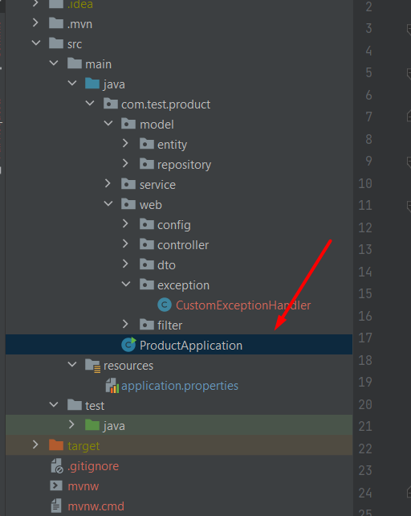

# Products

## Connect to Postgres Database

```
docker run --name shop-db -p 5431:5432 -e POSTGRES_USERNAME=postgres -e POSTGRES_PASSWORD=postgres postgres:14.1
```

### Create database into container (using CLI)

```
docker exec -it shop-db /bin/bash

psql -U postgres -d postgres

create database shop;

\c shop

create schema shop;
```

## Instruction for start up application

1. Clone this project to any IDEA.
2. Click RCM on this class



3. After that click LCM on this


4. Use this command in psql command line after application will have launched 
```
INSERT INTO shop.customer (id, customer_full_name, customer_login, customer_password, customer_role) VALUES(1, 'Manager',
'manager', '$2a$12$0GXZSVMlZVvjb2wufl5G3.kQBYT9eSG225zB0sG7PGRvnoL2YmFuy', 'MANAGER');
```

5. You can open postman or any other comfortable tools for you to make
   rest call.

6. The first of all you need to authenticate like user

endpoint

```
http://localhost:8080/api/v1/auth/register
```

7. After that login to app, using password and login

endpoint

```
http://localhost:8080/api/v1/auth/signIn
```

8. You will get jwt token, something like this


use it when you make different endpoint in authorization tab

9. Also, you have opportunity to configure application how you want,
   what will be deletion time after creation, and how many pools to use
   for ThreadPoolExecutor(IMPORTANT: use not more than you have on your machine)


